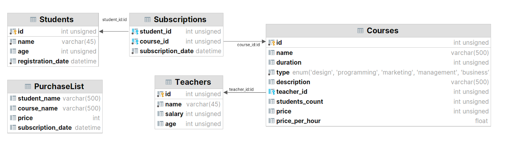
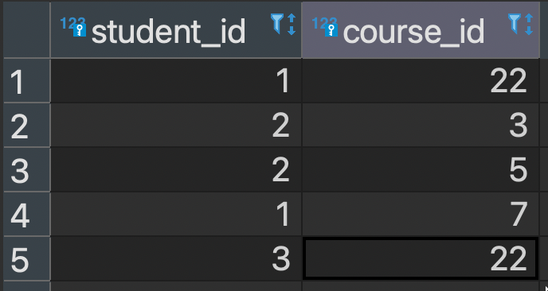

## SkillBox: Java

Модуль 16 
Работа с MySQL в Java

- 16.1 Установка MySQL
- 16.2 Подключение через JDBC
- 16.3 Запросы без ResultSet
- 16.4 Hibernate — подключение и настройка
- 16.5 Hibernate: изменение данных в базе
- 16.6 Связи ManyToOne и OneToMany
- 16.7 Связь ManyToMany
- 16.8 Hibernate query builder
- 16.9 Ленивая загрузка данных
- 16.10 Where и OrderBy
- 16.11 HQL
- 16.12 Практическая работа №1
- 16.13 Практическая работа №2

---

### 16.12 Практическая работа №1
#### Задание 1. Приложение, выполняющее SQL-запрос к базе данных

Научиться:
+ подключать MySQL в проекте;
+ писать SQL-запросы к базе данных в коде.
<br><br>

#### Что нужно сделать
1. Создайте новый проект в папке SQLAndHibernate из репозитория java_basics. 
В этой же папке вам предстоит создавать и другие проекты к этому модулю.
2. Подключитесь к установленному на вашем компьютере SQL-серверу. Если вы его 
ещё не установили, самое время это сделать. Подробнее можно узнать в инструкции.
3. Залейте на ваш локальный SQL-сервер готовый дамп базы данных, с которым предстоит 
работать. Инструкции для загрузки дампа: Windows, macOS.
4. Напишите код, который подключится к установленному на вашем компьютере 
SQL-серверу и нужной базе данных.
5. Напишите код, который выведет среднее количество покупок в месяц для каждого 
курса за 2018 год. Учитывайте диапазон месяцев, в течение которых были продажи. 
Подробнее в примере ниже (раздел «Советы и рекомендации»).
6. Старайтесь использовать только SQL, при этом группировку по месяцам можно 
сделать и с помощью кода на языке Java.
<br>
<br>

#### Советы и рекомендации

+ Пример расчёта для курса «Веб-разработчик c нуля до PRO»: 
    операцию в отдельных методах):
    ```
    SELECT pl.course_name, pl.subscription_date FROM PurchaseList pl WHERE pl.course_name = "Веб-разработчик c 0 до PRO" ORDER BY pl.subscription_date;
    course_name |subscription_date |
    --------------------------|-------------------|
    Веб-разработчик c 0 до PRO|2018-01-02 00:00:00|
    Веб-разработчик c 0 до PRO|2018-02-16 00:00:00|
    Веб-разработчик c 0 до PRO|2018-04-02 00:00:00|
    Веб-разработчик c 0 до PRO|2018-05-17 00:00:00|
    Веб-разработчик c 0 до PRO|2018-07-01 00:00:00|
    Веб-разработчик c 0 до PRO|2018-08-15 00:00:00|
    ```
    
    Курсы продавались с января по август, то есть восемь месяцев. Всего продано шесть 
    подписок. Значит, среднее значение продаж для курса «Веб-разработчик c нуля до PRO» — 0,75.
    
    Чтобы получить значение месяца из даты в числовом значении, используйте функцию:
    ```
    MONTH( date_value )
    https://schoolsw3.com/sql/func_mysql_month.php
    ```
    
    Пример использования:
    ```
    SELECT * FROM Students s 
    WHERE MONTH(s.registration_date ) = 4;
    ```
    
    Этот запрос выведет всех участников курса, зарегистрированных в апреле:
    ```
    id|name |age|registration_date |
    --|------------------|---|-------------------|
    14|Кутяков Ефрем | 31|2016-04-01 00:00:00|
    15|Бондарев Игорь | 32|2016-04-08 00:00:00|
    16|Журавлев Севастьян| 33|2016-04-15 00:00:00|
    17|Иньшов Геннадий | 34|2016-04-22 00:00:00|
    18|Шабанов Клавдий | 35|2016-04-29 00:00:00|
    67|Бугаков Валерий | 34|2017-04-07 00:00:00|
    68|Гайденко Илья | 35|2017-04-14 00:00:00|
    69|Перехваткин Сергей| 36|2017-04-21 00:00:00|
    70|Барсуков Виктор | 37|2017-04-28 00:00:00|
    ```

+ Иногда ошибка связана с часовым поясом:<br>
ERROR: The server time zone value ‘�й���׼ʱ��’ is unrecognized or represents more 
than one time zone. You must configure either the server or JDBC driver 
(via the serverTimezone configuration property) to use a more specific time zone 
value if you want to utilize time zone support.
<br>
<br>
Если такая ошибка возникла, добавьте в строку соединения с базой данных параметр, 
указывающий часовой пояс serverTimezone=UTC или укажите конкретный часовой пояс 
(например, serverTimezone = Europe/Moscow).
<br>
<br>
Строка будет такой: <br>
`jdbc:mysql://localhost:3306/skillbox?useSSL=false&serverTimezone=UTC`
<br>
<br>

+ Ошибка com.mysql.cj.jdbc.exceptions.CommunicationsException: Communications link failure<br>
Не удалось подключиться к серверу базы данных. Проверьте хост и порт доступа 
до MySql сервера, убедитесь, что сервер запущен.

+ Ошибка java.sql.SQLException: Access denied for user 'root'@'172.17.0.1' 
(using password: YES)<br>
Сервер найден, ошибка при попытке получить доступ. Проверьте, что логин и пароль 
для подключения к БД верно указаны в файле конфигурации.

+ Ошибка java.sql.SQLSyntaxErrorException: Unknown database 'skillbox'<br>
Подключение к серверу успешно, авторизация пройдена. Не найдена база 'skillbox', 
убедитесь, что база создана.

### Критерии оценки
+ В консоль выводятся средние количества покупок курсов в месяц за 2018 год.

---

### 16.12 Практическая работа №2
#### Задание 2. Приложение на основе Hibernate, создающее таблицы в базе данных и работающее с данными в этих таблицах

#### Цели задания

+ подключать к проекту библиотеку Hibernate
+ создавать классы @Entity со связями
+ создавать таблицы в базе данных при помощи Hibernate и заполнять их данными

#### Что нужно сделать

+ Создайте новый проект в папке SQLAndHibernate из репозитория java_basics. 
В папке config есть пример XML-файла конфигурации Hibernate.
+ Создайте отдельную пустую базу данных MySQL, к которой будете подключаться 
в этом проекте и с которой будете работать.
+ Подключите библиотеку Hibernate к вашему проекту так, как показано в видео.
+ Создайте классы @Entity для всех таблиц и пропишите связи между ними в 
соответствии со схемой:

+ Запустите приложение, чтобы в базе данных автоматически появились созданные 
вами таблицы.
+ Залейте в эти таблицы [готовый дамп с данными](https://drive.google.com/file/d/1gJDwleoKffnRzwkbHtkV-8d7sSdYCWu3/view)
+ Создайте класс LinkedPurchaseList для таблицы со следующей структурой:
  - student_id
  - course_id

+ Конвертируйте данные таблицы PurchaseList в данные для таблицы LinkedPurchaseList, 
в которой уже хранятся идентификаторы студентов и курсов: 
пары значений student_id и course_id. Напишите соответствующий код, 
запустите его и убедитесь, что он выполнился верно.

В таблице LinkedPurchaseList не предполагается отдельной колонки с привычным 
идентификатором записи. В роли идентификатора здесь выступает пара student_id и course_id.
<br><br>
Это значит, что пара значений student_id и course_id уникальна для каждой записи. 
Такая пара позволит получить всех студентов курса по course_id или найти все курсы 
одного студента по student_id, а также связать эти id с данными таблиц Students и Courses.


Если мы попробуем добавить ещё одну запись student_id=3 и course_id=22, то база 
данных не позволит сделать это при составном ключе, так как такая пара уже есть.
<br><br>
Такая связка student_id и course_id уникальна, она называется составной ключ (composite key).
<br><br>
Один из вариантов создания составного ключа — написать отдельный класс, в котором 
поля будут содержать значения полей, входящих в составной ключ, и уже этот 
класс будет использоваться как основной ключ Entity.
<br><br>
Рассмотрим наш случай и создадим класс для составного ключа Subscription:
<br>
```
public class  SubscriptionKey implements Serializable { 
    @Column(name = "student_id") 
    private int studentId; 

    @Column(name = "course_id") 
    private int courseId; 

    //setters, getters, equals(), hashcode() 
}
```

Класс-ключ в @Entity используется следующим образом:

```
@Entity 
@Table(name = "Subscriptions") 
public class Subscription { 
    @EmbeddedId 
    private SubscriptionKey id; 

    @Column(name = "student_id", insertable = false, updatable = false) 
    private int studentId; 

    @Column(name = "course_id", insertable = false, updatable = false) 
    private int courseId; 
    
    //other fields, setter, getters
}
```

Аннотация @EmbeddedId говорит, что этот параметр является составным ключом.
<br><br>
Если поля ключа использовать и в основном классе @Entity, то необходимо запретить 
использование полей для вставки и обновления данных дополнительными параметрами 
insertable и updatable в аннотации @Column. Для вставки значений ключа используйте 
поля объекта SubscriptionKey id.
<br><br>
Чтобы получить объект из базы данных по составному ключу, необходимо в метод get() 
объекта Session передавать экземпляр составного ключа, например:
`Subscription subscription = session.get(SubscriptionKey.class, new PK(studentId, courseId));`

Аналогично и для создания новой записи: создаём объект класса SubscriptionKey и, используя геттер, устанавливаем значение в @Entity-класс.

Дополнительные примеры — в статье [«Первичные ключи в Hibernate»](https://mywebcenter.ru/pervichnye-klyuchi-v-hibernate-3843/)

#### Советы и рекомендации

+ Измените параметр hbm2ddl.auto на update в hibernate.cfg, чтобы структура базы 
данных обновлялась в зависимости от написанного кода классов @Entity. 
Список возможных вариантов hbm2ddl.auto:
  - validate — проверить схему, не вносить изменения в базу данных;
  - update — обновить схему;
  - create — создать схему, уничтожая предыдущие данные;
  - create-drop — отказаться от схемы, когда SessionFactory закрывается явно 
  (обычно, когда приложение остановлено).