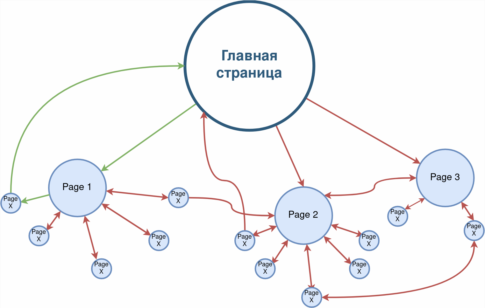

## SkillBox: Java

Модуль 17 (Обновлено, по лекциям теперь это модуль 19)

- 17.1 Зачем нужна многопоточность
- 17.2 Класс Thread
- 17.3 Интерфейс Runnable
- 17.4 Практическая работа №1
- 17.5 Состояние гонки и критические секции
- 17.6 Атомарные переменные
- 17.7 Ключевое слово Volatile
- 17.8 Synchronized-методы
- 17.9 Synchronized-блоки
- 17.10 Взаимодействие потоков — методы Wait и Notify
- 17.11 Потокобезопасные классы
- 17.12 Взаимная блокировка — Deadlock
- 17.13 Практическая работа №2
- 17.14 Интерфейс Callable
- 17.15 Executors, Executor и ExecutorService
- 17.16 Метод Shutdown
- 17.17 ThreadPoolExecutor
- 17.18 ScheduledExecutorService
- 17.19 Приостановка и прерывание потоков
- 17.20 ForkJoinPool и RecursiveTask
- 17.21 Практическая работа №3

---

### 17.21 Практическая работа №1
#### Задание 1. Приложение, выполняющее SQL-запрос к базе данных

Научиться:
+ Научиться использовать ForkJoinPool для решения рекурсивных задач.
<br><br>

#### Что нужно сделать
1. Создайте новый проект в директории Multithreading и напишите приложение, 
которое в многопоточном режиме сформирует карту заданного сайта (список 
ссылок), и запишите её в файл. Ссылки на дочерние страницы должны 
располагаться в файле с отступами на одну табуляцию относительно 
родительских.

```
Пример

https://skillbox.ru/

      https://skillbox.ru/media/

             https://skillbox.ru/media/management/

                    https://skillbox.ru/media/management/kak_rat_podkhod/
```
<br>
<br>

#### Советы и рекомендации

+ В файле должны быть ссылки на страницы, размещённые на том же 
домене (в примере — skillbox.ru). В списке не должно быть:
  - ссылок на другие сайты и поддомены,
  - ссылок на внутренние элементы страниц (у таких ссылок есть символ # после 
  адреса страницы).
<br>
<br>

+ При запросе страниц нужно выдерживать паузы (с помощью метода sleep() у потока), 
чтобы сайт не заблокировал доступ вашего приложения. Используйте 
значения от 100 до 150 мс.
<br>
<br>

+ Для отладки программы выберите сайт с сотнями или тысячами 
страниц (например, http://www.lenta.ru/), чтобы сервер вас не заблокировал.

+ Учитывайте что сайт имеет структуру графа, то есть страницы могут содержать 
ссылки на главную, на страницы с которой вы пришли по ссылке. Исключите 
возможность циклического перебора ссылок. Пример структуры и ссылок 
между страниц одного сайта:



зеленым отмечен пример циклического перебора по ссылкам.

### Критерии оценки
+ «Зачёт» — программа формирует список ссылок любого сайта и сохраняет в 
текстовый файл.
+ «Незачёт» — задание не выполнено.