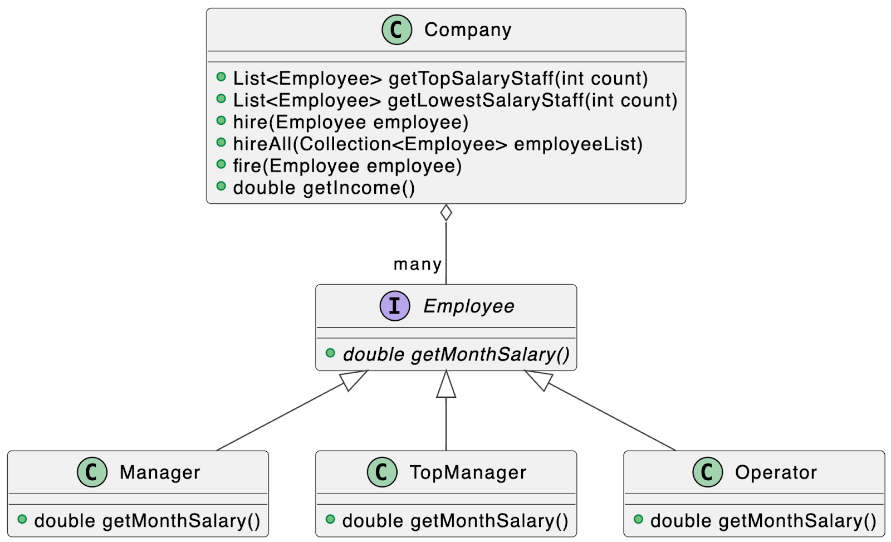

## SkillBox: Java

Модуль 12
Абстрактные классы и интерфейсы

- 12.1 Интро
- 12.2 Абстрактные классы
- 12.3 Интерфейсы
- 12.4 Интерфейсы в языке Java
- 12.5 Полиморфизм
- 12.6 Вложенные классы
- 12.7 Выводы модуля
- 12.8 Практическая работа
- 12.9 Тест

---

### Практическое задание:
Что нужно сделать
  
Выполните задание в репозитории `java_basics` в проекте `AbstractClasses/practice_1`. 
Директория пустая, вам необходимо в ней создать новый проект и выполнить задание.
 
1. Создайте класс компании Company, содержащей сотрудников и реализующей методы: 
   • найм одного сотрудника — `hire(Employee employee)`, 
   • найм списка сотрудников – `hireAll(Collection<Employee>` employes), 
   • увольнение сотрудника – `fire(Employee employee)`, 
   • получение значения дохода компании – `getIncome()`.  

Каждый метод НЕ должен иметь модификатор static, это позволит каждому объекту 
класса Company иметь свой набора сотрудников, свой расчет дохода, увольнение и найм. 
Аргументы и возвращаемое значение методов выберите на основании логики работы 
вашего приложения.
  
2. Создайте два метода, возвращающие список указанной длины (count). Они 
должны содержать сотрудников, отсортированных по убыванию и возрастанию 
заработной платы: 
   • List<Employee> getTopSalaryStaff(int count), 
   • List<Employee> getLowestSalaryStaff(int count).  

3. Создайте классы сотрудников с информацией о зарплатах и условиями 
начисления зарплаты:  

   • Manager — зарплата складывается из фиксированной части и бонуса в виде 
5% от заработанных для компании денег. Количество заработанных денег для компании 
генерируйте случайным образом от 115 000 до 140 000 рублей. 
   • TopManager — зарплата складывается из фиксированной части и бонуса 
в виде 150% от заработной платы, если доход компании более 10 млн рублей. 
   • Operator — зарплата складывается только из фиксированной части.  

Каждый класс сотрудника должен имплементировать интерфейс Employee. В интерфейсе 
Employee должен быть объявлен метод, возвращающий зарплату сотрудника, — getMonthSalary().
  
Аргументы и возвращаемое значение метода выберите в соответствии с логикой 
начисления зарплат. В интерфейсе объявите необходимые методы.
 
 

 
 
Для демонстрации и тестирования работы ваших классов:
1. Создайте и наймите в компанию: 180 операторов Operator, 80 менеджеров по 
продажам Manager, 10 топ-менеджеров TopManager.
2. Распечатайте список из 10–15 самых высоких зарплат в компании.
3. Распечатайте список из 30 самых низких зарплат в компании.
4. Увольте 50% сотрудников.
5. Распечатайте список из 10–15 самых высоких зарплат в компании.
6. Распечатайте список из 30 самых низких зарплат в компании.

---

Примеры вывода списка зарплат 
Список из пяти зарплат по убыванию:
• 230 000 руб. 
• 178 000 руб. 
• 165 870 руб. 
• 123 000 руб. 
• 117 900 руб. 

### Рекомендации
• Сделайте возможным создание разных экземпляров компании со своим списком 
сотрудников и доходов.
• Чтобы получить данные компании внутри класса сотрудника, настройте хранение 
ссылки на Company и передавайте объект Company с помощью конструктора или сеттера.
• В методы получения списков зарплат могут передаваться значения count, 
отрицательные или превышающие количество сотрудников в компании.