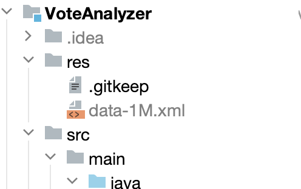

## SkillBox: Java

Модуль 19 `(Обновлено, по лекциям теперь модуль - 21)`

- 19.1 Протокол HTTP. Запрос и ответ
- 19.2 Методы HTTP-запросов GET и POST
- 19.3 Другие методы HTTP-запросов
- 19.4 Статус-коды HTTP-ответов
- 19.5 Адресация сетевых ресурсов
- 19.6 REST: теория и практика
- 19.7 HTTP-заголовки
- 19.8 Версии протокола HTTP и HTTPS

---

[//]: #TODO: (УДАЛИТЬ ПРИ КОММИТЕ!!!)
### 18.18 `(Обновлено, по лекциям теперь модуль - 20.18)` Практическая работа №1
#### Задание 1. Приложение, выполняющее SQL-запрос к базе данных

Научиться:
+ базовым принципам оптимизации работы со строками.
  

#### Что нужно сделать
1. Внесите изменения, сделанные в видео, в проект CarNumberGenerator, находящийся 
в папке Performance в репозитории java_basics. Оптимизируйте его:
   + Реализуйте вывод номеров одновременно в несколько файлов из нескольких потоков.
   + Оптимизируйте метод padNumber().
2. Измерьте, насколько программа стала работать быстрее или, наоборот, медленнее.
3. Напишите результаты ваших измерений в ответе.
4. Объясните, почему это произошло, по вашему мнению.
 
 

#### Советы и рекомендации
+ -

### Критерии оценки
+ Принято — скорость работы программы заметно увеличилась, проведены замеры 
скорости работы, участник курса верно объяснил причины такого ускорения.
+ На доработку — задание не выполнено.

---

### 18.19 `(Обновлено, по лекциям теперь модуль - 20.19)` Практическая работа №2
#### Задание 1. Быстрая загрузка больших объёмов данных в базу

Научиться:
+ -
    

#### Что нужно сделать
1. Перепишите проект VoteAnalyzer в папке Performance репозитория java_basics, 
чтобы он максимально быстро загружал в базу данных XML-файл размером 1,5 Гб. 
Используйте все знания, полученные в этом модуле.
2. Загрузите XML-файлы из архива в директорию res-проекта.
3. Важно! Не загружайте в репозиторий в GitLab XML-файлы!
    
    

#### Советы и рекомендации
+ Если при запуске приложения у вас возникает ошибка: 
    Exception in thread "main" java.io.FileNotFoundException: …res/data-1M.xml 
    (No such file or directory) 
    …убедитесь, что вы скопировали файл data-1M.xml из архива в директорию res. 
    В дереве файлов в IntelliJ IDEA это должно выглядеть так:
    

### Критерии оценки
+ Принято — файл 1,5 Гб загружается в базу данных, в программе используется:
    - SAX-механизм чтения XML-файлов (порционное чтение);
    - конкатенация строк при помощи StringBuilder;
    - загрузка данных в базу при помощи множественных INSERT’ов.
+ На доработку — задание не выполнено.